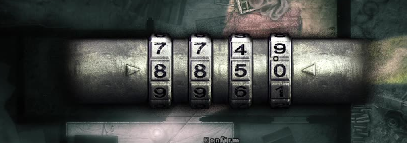

# Darkwood cheat codes

This is a small cheat program for the survival horror game [Darkwood](https://store.steampowered.com/app/274520/Darkwood/). The game comes with code locked features that really slows down the player advancement throught the story. This program solves this by reading the codes from the save files.

## Usage

- Enter the game
- Create a profile and start it _(optional if you already have one)_
- Pause the game and execute the _darkwood-cheatcodes.sh_
- Now you should get a Notepad popup with the codes
- Resume the game and enjoy

## Requirements

- (At the moment) It runs only on Windows
- Installed [Git-Bash](https://git-scm.com/downloads/win)

## Foot note

I'm planning on making this available on Linux and MacOS as well, without Git-Bash.